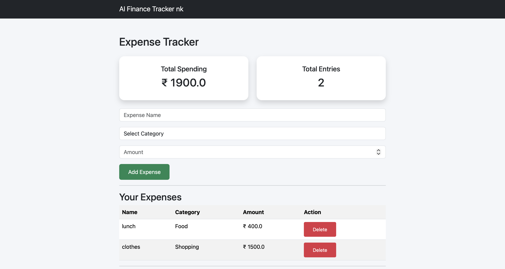
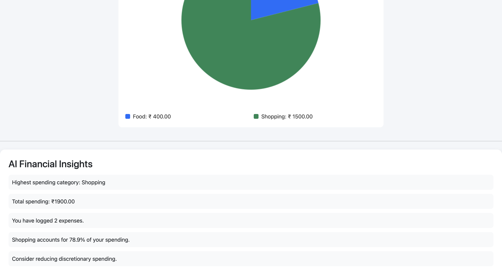

#  AI Finance Tracker

An AI-powered personal finance dashboard built using **Flask, SQLite, and Chart.js**. The application helps users track expenses, visualize spending patterns, and receive AI-generated financial insights.

---
## Preview





##  Features

* Add expenses
* Delete expenses
* Categorize spending
* Dashboard with total spending and total entries
* Interactive pie chart visualization
* AI-generated spending insights
* SQLite database for persistent storage
* Responsive Bootstrap interface

---

## 🛠️ Tech Stack

**Frontend**

* HTML
* CSS
* Bootstrap
* Chart.js

**Backend**

* Python
* Flask
* Flask-SQLAlchemy

**Database**

* SQLite

---

##  AI Spending Advisor

The application analyzes spending data and generates insights such as:

* Highest spending category
* Total spending
* Number of expenses logged
* Percentage spent in each category
* Personalized spending recommendations

---

##  Project Structure

```
AI-Finance-Tracker/

│── app.py
│── requirements.txt
│── README.md
│── .gitignore

├── templates/
│     ├── layout.html
│     └── index.html

├── static/
│     └── style.css
```

---

## ⚙️ Installation

Clone the repository:

```bash
git clone https://github.com/YOUR_USERNAME/AI-Finance-Tracker.git
```

Navigate to the project:

```bash
cd AI-Finance-Tracker
```

Create a virtual environment:

```bash
python3 -m venv venv
source venv/bin/activate
```

Install dependencies:

```bash
pip install -r requirements.txt
```

Run the application:

```bash
python app.py
```

Open:

```
http://127.0.0.1:5000
```

---

##  Future Improvements

* Edit expenses
* User authentication
* Monthly reports
* Export to CSV/PDF
* LLM-powered financial recommendations
* Cloud deployment

---

##  Author

**Niva Kalia**

Built as a portfolio project to strengthen full-stack development skills and explore AI-assisted personal finance applications.
